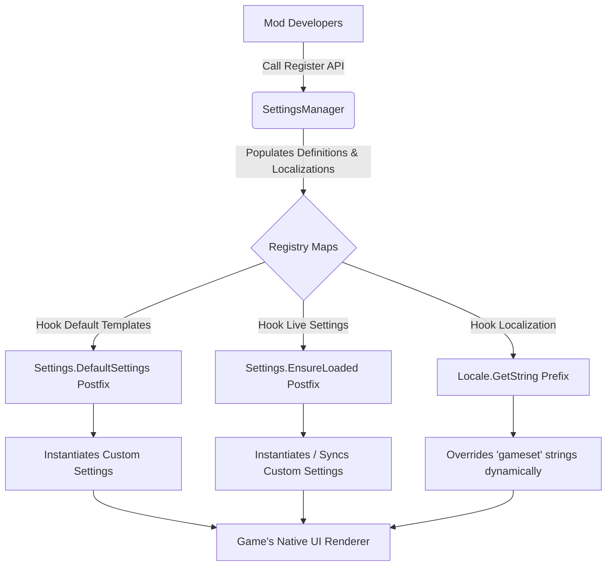

# ScavSetLib (ScavSettingsLib) — Official API Reference

`ScavSetLib` is an independent, highly optimized class library/API designed for BepInEx mod developers of **Casualties Unknown**. It allows mods to register custom settings (Dropdowns, Floats, Integers, or Booleans) directly inside the game's official menus (Video, Audio, Game, etc.) with native styling, native sliders, native toggle switches, and fully automatic loading, saving, and localization lookup overrides.

---

## 1. Core Technical Architecture

The library bypasses the need for every developer to write redundant Harmony patches on the game's settings template lists and `Locale` translations. Instead, it runs a single centralized patch system that dynamically polls custom setting definitions and resolves their visual naming at runtime.



---

## 2. API Structuring

### 2.1 Supported Setting Types
*   **Dropdowns (`SettingDropdown`):** Selection menus with clean option labels.
*   **Float Sliders (`SettingFloat`):** Float values with customizable range (min/max) and string formatting (e.g. percentages, decimals).
*   **Integer Sliders (`SettingInt`):** Integer step-based ranges (min/max).
*   **Toggle Switches (`SettingBool`):** Standard true/false checkboxes.

### 2.2 Base Setting Definition
All setting types inherit from a base definition class that populates core fields such as internal name, category (Video, Audio, Game, Input, Language), and synchronizes values when modified elsewhere.

```csharp
public abstract class SettingDefinition
{
    public string Name { get; set; } = string.Empty;
    public Setting.SettingCategory Category { get; set; }
    public string CleanName { get; set; } = string.Empty;

    public abstract Setting CreateSettingInstance();
    public abstract void SyncValueFromSource(Setting setting);
}
```

---

## 3. How to Use ScavSetLib in Your Mod

### Step 1: Declare the BepInEx Dependency
Ensure BepInEx is aware that your mod depends on `ScavSetLib` so it loads in the correct order:
```csharp
[BepInPlugin("com.yourname.yourmod", "YourMod", "1.0.0")]
[BepInDependency("com.kanisuko.scavsetlib")]
public class YourPlugin : BaseUnityPlugin
{
    // ...
}
```

### Step 2: Register Settings inside `Awake()`
To inject custom settings, call the static `ScavSetLib.SettingsManager` registration methods during initialization.

```csharp
using ScavSetLib;

private void Awake()
{
    // 1. Register a Dropdown setting inside the native VIDEO category
    SettingsManager.RegisterDropdown(
        name: "MyCustomMode",
        category: Setting.SettingCategory.Video,
        choices: new string[] { "Off", "Low", "Ultra" },
        defaultValue: 0,
        onApply: (selectedVal) => {
            // Callback when modified in-game
            MyConfig.CustomMode.Value = selectedVal;
        },
        valueGetter: () => MyConfig.CustomMode.Value, // For active synchronization
        cleanName: "Ultra Visual Mode",               // Clean display label
        cleanChoiceNames: new string[] { "Disabled", "Standard Quality", "Extreme Ultra" } // Clean options
    );

    // 2. Register a Slider setting inside the native GAME category
    SettingsManager.RegisterFloat(
        name: "MyCustomSpeed",
        category: Setting.SettingCategory.Game,
        min: 0.5f,
        max: 2.0f,
        defaultValue: 1.0f,
        onApply: (speedVal) => {
            MyConfig.GameSpeed.Value = speedVal;
        },
        valueGetter: () => MyConfig.GameSpeed.Value,
        cleanName: "Simulation Velocity",
        formatValue: (val) => $"{val:F1}x" // Formats float slider label natively
    );
}
```

---

## 4. Under the Hood Mechanics

### 4.1 Native UI Rendering Hooking
When `SettingsMenu.SelectTab(SettingCategory)` is invoked, it instantiates option prefabs by looping through `Settings.settings`. Because `ScavSetLib` injects your settings directly into `Settings.settings` (and matches values loaded from save files), the game **automatically creates and renders native GameObjects** (sliders, toggles, dropdown boxes) using its built-in styling, saving you hours of manual UI development!

### 4.2 Bulletproof Localization Interception
The game automatically prepends `"gameset"` to unregistered options when fetching localizations, which would normally result in broken text (e.g., `"gamesetUltra Visual Mode"`). 

To prevent this, `ScavSetLib` intercepts `Locale.GetString(string str, int type)` with a `HarmonyPrefix` and does a high-performance $O(1)$ dictionary lookup to immediately swap prefix strings:

```csharp
[HarmonyPatch(typeof(Locale), "GetString")]
[HarmonyPrefix]
public static bool GetString_Prefix(string str, int type, ref string __result)
{
    if (str != null && SettingsManager.TryGetLocalization(str, out string localized))
    {
        __result = localized;
        return false; // Skip original game dictionary lookup
    }
    return true; // Default fallback for native game strings
}
```

This guarantees:
1.  **Dynamic Custom Labeling:** Perfectly matches clean strings provided by developers.
2.  **No Wrapping Anomalies:** Choice items in dropdown lists display properly formatted text, eliminating ugly text wrapping.
3.  **Zero Overhead:** The dictionary check runs instantly and has negligible performance impact on original game translation files.

---

> [!NOTE]
> `ScavSetLib` operates as a pure, standalone, dependency-free API, requiring only basic Unity/BepInEx libraries.
